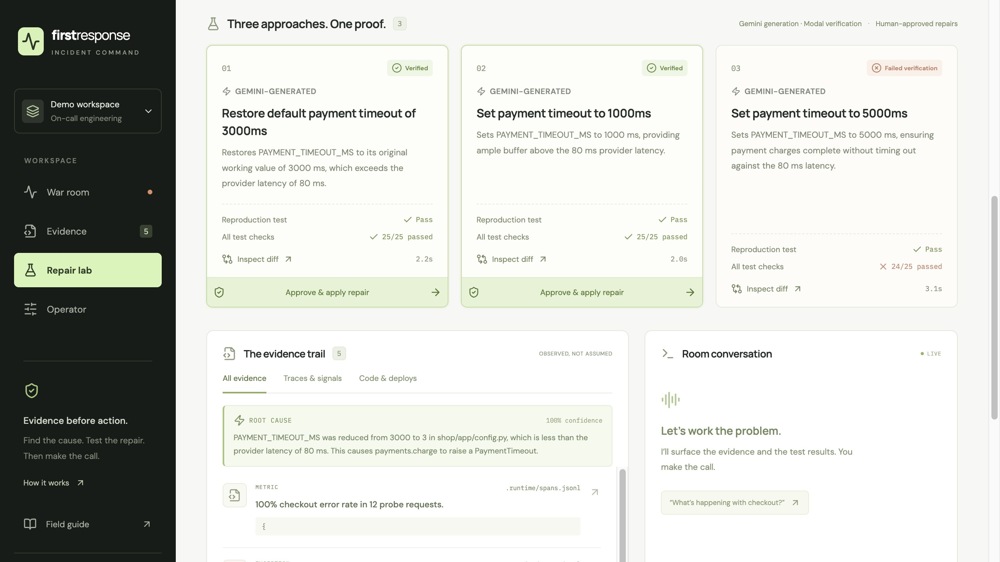
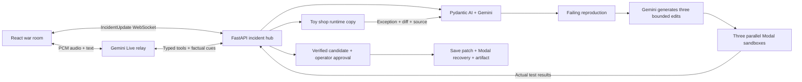

# First Response

**An incident copilot that brings you evidence—and a repair it has actually tested.**

Talk to the room while the investigation runs. Gemini explains the observed failure and writes three candidate edits from the broken source. Independent Modal sandboxes test every candidate. Only a repair that passes the reproduction and regression suite becomes eligible for your approval. Approval applies the patch to the toy shop, reruns verification, and produces a downloadable diff.

Built for the Tech: Europe Agentic AI Hack, London, 19 September 2026.

[Watch the two-minute demo](https://github.com/hashkanna/first-response/releases/tag/v1.0.0) · [Public source](https://github.com/hashkanna/first-response) · [Continuous integration](https://github.com/hashkanna/first-response/actions/workflows/ci.yml)



## Observed in the live build

Gemini generated three timeout repairs from the broken source. Two passed all 25
checks; the third passed the reproduction but failed a timeout-enforcement
regression. The operator selected a passing patch, and fresh Modal recovery passed
25 tests and 12 checkout probes. The UI measured 10.0 seconds to verified candidates
in that run. [Inspect the actual diffs, provider receipt and test logs](docs/generated-run-evidence.md), or the [final integrated voice and approval check](docs/final-check.md).

Real Gemini Live checks also passed speech transcription, native audio output,
barge-in, explicit negation and reconnect, using synthesized PCM input through the
actual relay. Human microphone/headset use is a separate rehearsal step. The [two-minute demo](docs/demo-video.md) uses actual UI captures and includes actual Gemini Live recovery audio; edited highlights and synthesized narration are labeled.

## Run it

Requires Python 3.11+, Node.js 22.12+ (or a supported newer release), and [uv](https://docs.astral.sh/uv/).
Run the following commands from the repository root:

```bash
uv venv .venv --python 3.11
uv pip install --python .venv/bin/python -r requirements.lock
npm --prefix web ci
test -f .env || cp .env.example .env
./scripts/dev.sh
```

Open **http://127.0.0.1:5173**. The app starts in **Rehearsal**, a clearly labeled recorded event player that does not require the backend or credentials. Press **Run rehearsal**. Pause, inspect the evidence and diffs, compare results, and export the incident record.

For a real fault and real local tests, switch to **Live system → Operator** and inject either fault. Local mode is deterministic and uses only this repository's authored code. It is an offline development path, not an isolation boundary for untrusted code.

The launcher defaults to hub port **8000** and frontend port **5173**. It stops with a clear error if either is occupied; it never stops another project. To use a different hub port:

```bash
WAR_ROOM_PORT=8001 ./scripts/dev.sh
```

The launcher sets the frontend's `VITE_HUB_URL` to the chosen loopback hub address for that process, taking precedence over Vite `.env` files. API docs and the optional setup page then use the chosen port, for example `http://127.0.0.1:8001/docs`. If a frontend is already running, do not launch a second copy; restart only the processes for this project when changing their configuration.

For separate terminal sessions, pair the addresses explicitly:

```bash
# Terminal 1
.venv/bin/python -m uvicorn core.hub:app --host 127.0.0.1 --port 8001
# Terminal 2
VITE_HUB_URL=http://127.0.0.1:8001 npm --prefix web run dev
```

Alternatively, set the public address in ignored `web/.env.local`. The current demo workspace uses port 8001 because another project occupies 8000; the repository's portable default remains 8000.

## Run the cloud demo

Use the same UI with real Pydantic AI analysis, Gemini Live audio, and Modal execution. Set these **backend-only** values in the ignored `.env`:

```dotenv
GEMINI_API_KEY=your_key
INVESTIGATOR_BACKEND=gemini
REPAIR_BACKEND=gemini
VERIFICATION_BACKEND=modal
GEMINI_INVESTIGATOR_MODEL=gemini-3.8-flash
GEMINI_LIVE_MODEL=gemini-3.8-live
```

Authenticate Modal using its official CLI and warm the image:

```bash
.venv/bin/python -m modal token new
.venv/bin/python -m scripts.check_modal --prepare-only
./scripts/dev.sh
```

The existing active Modal profile is used; tokens are never copied into a sandbox. If already authenticated, skip `modal token new`. Use `WAR_ROOM_PORT=8001 ./scripts/dev.sh` here as well when port 8000 is occupied. Gemini can alternatively use Vertex Application Default Credentials; see [Live setup](live/README.md).

In **Live system**, connect Gemini using **Connect Gemini Live**. The adjacent terminal button connects with typed input and spoken Gemini output, without requesting the microphone. Use a headset for the voice demo. Choose a fault in **Operator** and ask “What’s happening with checkout?” The agent receives investigation milestones while the conversation continues. Ask about the cause or attempted repairs, then approve the verified repair with a complete typed command or the review button.

In the verified Gemini 3.8 path, a spoken apply request can open patch review because the observed stream omits transcription finality; typed or UI confirmation completes approval. The relay also supports finalized, incident-bound affirmative speech, but that direct approval path has not been observed in provider checks.

A running development hub can also accept an existing API key in memory at **http://127.0.0.1:8000/setup** when started with `WAR_ROOM_ENABLE_SETUP=1`. That page is restricted to the loopback interface, requires same-origin CSRF validation, and never writes the key to disk. The key disappears when the server stops. Restarting requires reconfiguration.

Provider errors are visible. Cloud verification never silently falls back to local execution, and failed model analysis never silently becomes a predefined diagnosis.

## The two incidents

| Incident | Actual fault | Verified repair |
|---|---|---|
| Payment timeout | A 3,000 ms budget becomes 3 ms; real checkout probes raise `PaymentTimeout`. | Restore the expected timeout. |
| Missing coupon | Checkout accesses `coupon.code` when the optional coupon is `None`. | Guard the optional value without losing existing coupon behavior. |

Every candidate runs one reproduction test and 24 regression tests. In generated mode, Gemini proposes three distinct edits intended to preserve behavior; zero, one or several may pass. The authored offline candidates include deliberately incomplete alternatives to demonstrate why the regression suite matters. Only an applied candidate with both suites passing, positive test count, and zero failures is eligible.

Fault injection and approval only change `.runtime/shop`. The checked-in clean shop stays intact. Reset cancels ongoing work, invalidates old results, and restores the runtime copy. No production services, remote branches, or pull requests are changed.

## What is real, and what is rehearsed?

| Capability | Implementation |
|---|---|
| Fault injection and observed evidence | Real runtime code edits, checkout probes, stack traces, numbered source, unified diff; JSONL evidence on disk. |
| Gemini investigator | Pydantic AI typed root-cause analysis of actual evidence; referenced IDs, source location, and exact evidence quotations are validated. Bounded retries and usage. |
| Candidate patches | With `REPAIR_BACKEND=gemini`, Pydantic AI asks Gemini to generate three distinct assignment edits from actual source, evidence and the failing reproduction. Typed output, structural validation and a SHA256 source binding precede Modal execution. Offline mode uses authored candidates. |
| Modal verification | Real network-disabled sandboxes, independent copies, actual pytest results, bounded resources, termination in `finally`. |
| Gemini Live | Native PCM audio, streaming transcripts, manual tool routing, interruption cues, and incident-bound approval. |
| Approval | Explicit operator action, matching incident and candidate, post-apply verification with rollback on failure. |
| Rehearsal player | Recorded fixtures, clearly labeled. No provider or sandbox calls. |
| Local fallback | Predefined diagnosis + actual local subprocess tests; for trusted repository fixtures only. |
| Logfire / Gateway / Jev / GitHub PR | Not integrated. Local JSONL traces, direct Gemini provider, conservative rules, downloadable patch. |

Generation is deliberately constrained to one existing assignment line per candidate. Tests, imports, initializers and new files cannot be edited. Generated code is never executed on the host, including recovery probes after approval. The authored reproduction and regression suite remain independent of generation.

This is a demonstrable agentic workflow for two controlled incidents. Passing the tests establishes the tested behavior; it is not a claim of universal repair safety.

## Architecture



- `core/`: Pydantic contracts, incident state, WebSockets, approval and triage rules.
- `agent/`: evidence collection, Gemini analysis and generation, plus offline fault/candidate fixtures.
- `shop/`: small checkout/payment system, 24 regression tests, fault and reproduction fixtures.
- `verification/`: snapshot-bound edit validation, Modal execution, and a trusted-fixture local runner.
- `live/`: server-only Gemini credentials, PCM relay, validated tools, approval latch.
- `web/`: React/TypeScript command center, replay engine, validated event reducer, browser audio.
- `scripts/`: local launcher and bounded Modal warmup/smoke checks.

Details: [architecture](docs/architecture.md), [API](docs/api.md), [Gemini investigator](agent/README.md), [Gemini Live](live/README.md), [Modal](docs/modal.md), [generated repairs](docs/repair-generation.md), [demo script](docs/demo.md), [judging notes](docs/judging.md).

## Verification

```bash
INVESTIGATOR_BACKEND=local REPAIR_BACKEND=authored VERIFICATION_BACKEND=local WAR_ROOM_ENABLE_SETUP=0 .venv/bin/python -m pytest -q
npm --prefix web test
npm --prefix web run build
```

Cloud smoke tests spend a small amount of Modal credit and terminate each sandbox:

```bash
.venv/bin/python -m scripts.check_modal --fault bad_config
.venv/bin/python -m scripts.check_modal --fault null_error
```

Tests cover both complete local fault/repair loops, stale and premature approvals, failed post-apply rollback, reset cancellation, isolated incident state, malformed events, reconnect replay, sandbox cleanup and resource limits, Gemini protocol, and evidence grounding. Cloud receipts are local and ignored under `.runtime/modal-checks/`; do not mistake offline SDK mocks for cloud execution.

Before the generated-repair upgrade, both faults completed through the actual browser with Gemini/Pydantic AI diagnosis, three authored-candidate Modal verifications, operator approval, post-apply Modal verification, and 12 healthy checkout probes. The observed times to a verified fix were 8.6 seconds and 7.4 seconds; these are individual results, not guarantees. Gemini Live received typed input, delivered model audio/transcripts, and routed the first approval through its tool. Browser instrumentation confirmed 1,077,604 native PCM bytes received. No human microphone was used. See the [execution evidence](docs/verification-evidence.md) for timestamps, counts and scope.

[CI](.github/workflows/ci.yml) runs Python 3.11 tests and Node 22 tests/builds with local backends and setup disabled. It never runs the cloud smoke scripts or requires provider secrets. The web dependency graph is locked by `web/package-lock.json`; Python dependencies are pinned in `requirements.lock`, generated from the ranges in `requirements.txt`.

## Operational notes

- Bind the hub to `127.0.0.1`. This is a single-operator hackathon app, not an authenticated production service.
- `.env`, `.runtime`, virtual environments, and build artifacts are ignored. Never put provider keys in `VITE_` variables.
- Browser microphone access requires permission and a secure context (`localhost` works). Audio goes to Gemini only when connected. Audio is not saved by this app.
- Browser speech recognition is a separate optional rehearsal fallback and may use the browser provider's service.
- Modal sandboxes cannot access the network and receive only the Python shop snapshot and reproduction. The default runner limit is 60 seconds per sandbox.
- The UI accepts `VITE_HUB_URL` in ignored `web/.env.local` or its process environment for a different backend origin. `scripts/dev.sh` sets it to the selected `WAR_ROOM_PORT`. Additional browser origins must be explicitly allowed on the backend.
- The original planning document is preserved in [BUILD.md](BUILD.md) as historical input; this README describes the implementation that shipped.
