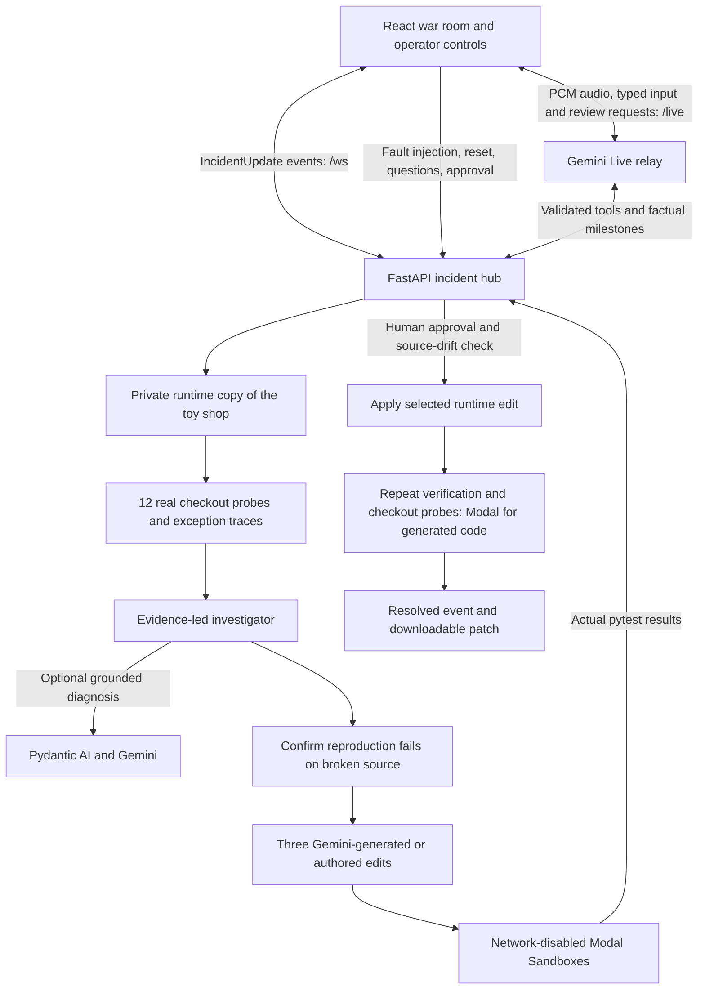

# First Response: architecture and boundaries

First Response investigates two reproducible checkout faults, displays the evidence,
verifies competing repairs, and waits for an operator before changing the runtime
toy shop. The UI is driven by typed incident events. Conversation and verification
run independently so a voice connection cannot invent a passing test.

Public repository: [hashkanna/first-response](https://github.com/hashkanna/first-response).

## Components

| Source | Responsibility |
| --- | --- |
| `core/contracts.py` | Pydantic wire models for alerts, evidence, causes, candidates, results, cues and tool arguments |
| `core/hub.py` | One active incident, background task lifecycle, WebSocket history, approval transaction and patch artifacts |
| `agent/fixtures.py` | Two authored faults, reproductions and three competing repairs per fault |
| `agent/investigator.py` | Evidence collection, diagnosis, reproduction, concurrent verification and milestone emission |
| `agent/gemini.py` | Optional Pydantic AI diagnosis with validated citations and source references |
| `agent/generation.py` | Gemini proposes three distinct assignment edits from observed source and evidence |
| `verification/generated.py` | Immutable snapshot identity, bounded path/edit validation, AST screening and source writes as data |
| `verification/runner.py` | Real pytest execution in separate temporary local copies; trusted fixture code only |
| `verification/modal_runner.py` | Real cloud isolation, bounded resources, source upload and mandatory cleanup |
| `live/` | Server-side Gemini Live connection, audio relay, validated tools and approval latch |
| `web/src/lib/incident.ts` | Runtime event validation, partial-event merge, ordering, incident isolation and elapsed timer |
| `web/src/lib/useWarRoom.ts` | Reconnect/replay, recorded rehearsal, transcript and HTTP actions |

## Execution modes

| Mode | Investigation and repairs | Verification | What can change? |
| --- | --- | --- | --- |
| Recorded rehearsal | Illustrative recorded events | No tests execute | Nothing; review the recorded diff only |
| Local + authored | Actual exceptions and source matched to the controlled scenario; fixture repairs | Real subprocesses in independent copies | Only the runtime shop, after approval |
| Modal + authored | Local or Gemini diagnosis; fixture repairs | Real network-disabled Modal Sandboxes | Only the runtime shop, after approval |
| Modal + generated | Local or Gemini diagnosis; a separate Pydantic AI/Gemini agent generates three bounded edits | Initial tests and post-approval tests/probes all run in Modal | Host saves the selected edit as text after approval; generated code never executes on the host |

Gemini Live is an independent optional conversation layer. It does not perform
verification itself. Selecting a cloud backend is explicit; provider errors stop
that path instead of silently changing to local execution or replay.

`VERIFICATION_BACKEND` chooses `local` or `modal`.
`INVESTIGATOR_BACKEND` chooses `local` or `gemini`.
`REPAIR_BACKEND` chooses `authored` or `gemini`; generated repairs require Modal.
`/health` exposes configured modes and dependency/credential availability. A
configured capability does not prove a successful provider request.

## Evidence and verification

The operator injects one exact-line fault into `.runtime/shop`, leaving the
checked-in shop clean. Twelve checkout probes execute against that runtime and
produce measured outcomes and exception traces in `.runtime/spans.jsonl`.
These are local probe observations, not production traffic or Logfire queries.
The deploy evidence is the actual injected source diff; there is no invented git
commit associated with that runtime change.

The optional Gemini investigator receives those exceptions, the diff and numbered
toy-shop source. Its structured result must cite existing evidence, quote actual
substrings and identify the known changed file, line, service and fault mechanism.
Analysis is bounded to three requests and 45 seconds. This is constrained diagnosis
of two rehearsed faults, not discovery of arbitrary production failures.
With `REPAIR_BACKEND=gemini`, a second typed agent derives three distinct edits
from the observed source and diagnosis. The reproduction and regression suite
remain authored and immutable. With `REPAIR_BACKEND=authored`, repairs come from
repository fixtures. See [generation and validation](repair-generation.md).

Generated changes are limited to one existing assignment expression in an existing
`app/*.py` module. Tests, probes and package entrypoints are immutable; new files,
path traversal, symlinks, imports and dynamic/process/file/network operations are
rejected. The AST screen reduces the allowed edit surface; Modal is the execution
isolation boundary. Zero, one or several generated repairs may pass the suite.

A failing reproduction must be an actual pytest test failure, not a collection
error or timeout. After that check, three candidate jobs run concurrently. Each
runs the reproduction and the unchanged 24-case shop suite, for 25 checks. A
candidate needs successful application, a passing reproduction, a passing suite,
nonzero executed tests and zero reported failures before backend approval.

Modal uploads only the validated Python snapshot and reproduction. Each sandbox
has outbound networking blocked, no credentials or mounted volumes, a 60-second
lifetime, and bounded CPU/memory. Cleanup terminates and detaches the sandbox on
success, error or cancellation. See [Modal operations](modal.md),
[cloud verification evidence](verification-evidence.md) and
[actual generated runs](generated-run-evidence.md).

## State and approval

Every `IncidentUpdate` carries an incident ID, stage, timestamp and factual message.
Evidence, candidates and results are partial lists merged by stable IDs; an omitted
list never clears previously received facts. Browser validation rejects malformed
payloads and unsafe PR URL protocols. An explicit reset or a newer alert starts a
new incident; retired incident events cannot overwrite the current case. The timer
runs from `alerted` until a supported `fix_verified` event.

The backend independently checks every approval. It binds the request to the active
incident and candidate, requires the completed verified stage, and compares the
current source against the exact patch previously shown. A lock serializes reset,
fault injection and approval. The chosen edit is applied only to the runtime copy,
then tested again and probed. Generated code and its recovery probes execute
exclusively in Modal; the host only saves validated source text. A SHA256 digest
binds the original Python source and immutable tests to generation, candidate
verification and approval. Recovery reconstructs that base in memory, verifies
the applied edit remotely and checks the host snapshot again before resolution.
Any failure restores the original file. A successful operation emits `resolved`
and exposes the approved patch as a downloadable file.
No GitHub pull request is created by this implementation.

Live tool calls cannot authorize themselves. An approval latch requires a recent,
explicit confirmation bound to the incident and already verified candidates, and
consumes the grant once. Typed Live approvals carry the browser's captured incident
ID. Review dialogs capture both the incident and candidate; the hub validates them
again on the final click. Reset invalidates prior approval and closes the dialog.

The observed Gemini 3.8 speech stream omitted the optional transcription completion
flag. Missing finality therefore never grants approval. An affirmative spoken
request can open the verified patch for review; an explicit UI confirmation or
complete incident-bound typed command applies it on this verified provider path.
The relay also supports affirmative speech with `finished=True` and matching
captured incident/candidate context; this direct spoken approval path is covered
by offline tests but has not been observed in provider checks.
A model's `turn_complete` is not
speech finality, and neither a pause nor a background cue creates authorization.
Speech context is captured at actual audio activity start; new speech revokes old
grants, reset discards that context, and negative transcript continuations remain
part of the same utterance across model response boundaries.

Actual provider checks used typed input and synthetic PCM speech. They establish
provider audio/transcription behavior, not human microphone or headset usability;
**no human microphone was tested**.

## API surface

The local default hub address is `http://localhost:8000`; its generated schema is
at `/docs` and `/openapi.json`.
Use `WAR_ROOM_PORT=8001 ./scripts/dev.sh` if another process owns port 8000. The
launcher supplies the matching `VITE_HUB_URL` to the frontend without rewriting
local configuration files.

| Endpoint | Input and behavior |
| --- | --- |
| `GET /health` | Configured execution modes and integration capabilities; no secrets |
| `GET /status` | Current incident, complete event history and approval status |
| `WS /ws` | Server sends reset followed by incident history, then live updates; browser messages cannot inject events |
| `POST /faults/bad_config/apply` | Inject the payment timeout fault and start the investigation |
| `POST /faults/null_error/apply` | Inject the missing-coupon fault and start the investigation |
| `POST /faults/reset` | Cancel the investigation, restore clean runtime code and clear incident state |
| `POST /say` | Typed command/question; include the current `incident_id` for any approval intent |
| `POST /approve` | JSON `incident_id` and `candidate_id`; apply only the matching verified repair |
| `GET /artifacts/{filename}` | Download a verified patch generated by an approved operation |
| `WS /live` | Gemini Live audio/text relay; typed approval includes `incident_id`; spoken review requests identify the incident and candidate without applying a change |

HTTP mutations and WebSockets check allowed browser origins. The hub is intended
for loopback use and does not implement public multi-user authentication. Keep it
local for the demo; do not expose an unauthenticated instance as a public service.

## Deliberate limits

The live hub and incident history are in memory. Reset removes the active case;
restarting the process is not durable incident recovery. There are two fault types,
a deterministic toy payment provider and an authored test suite. Passing that
suite demonstrates the rehearsed behavior, not general production safety.

There is no Logfire ingestion, Pydantic Gateway routing, Jev remote risk decision,
continuous production alerting, unrestricted patch generation or remote PR creation.
The risk gate uses local rules and always requires a human. Provider integration
proof must come from a successful actual request, not configuration alone.
